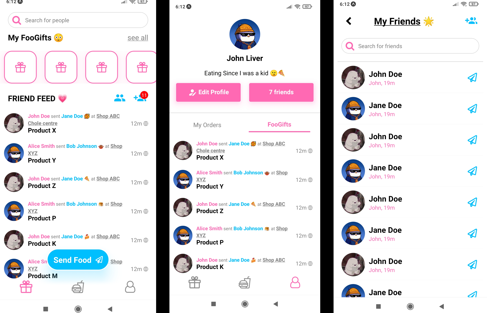

# FooShare : Social Food Takeaway App

## 🔦 About

FooShare is a mobile app designed to streamline the process of ordering food from local restaurants and cafes. It serves the primary function of making food ordering more convenient and social by leveraging technology and community engagement. Here is how it accomplishes this:

- **User-Friendly Ordering** : FooShare allows users to browse menus, place orders, and make payments directly through the app. This eliminates the need to wait in line or handle cash.

- **Takeaway** : Users can place their order ahead of time and takeaway it at time of their choice.

- **Rewards and Discounts** : The app includes a rewards system where users earn points with each purchase. These points can be redeemed for discounts or free items, incentivizing continued use of the app.

- **Social Features** : FooShare integrates social elements by allowing users to share their orders with friends, send gifts, and see what their friends are ordering. This creates a community feel and encourages social interactions around food.

## 🔎 Demo

 
 
 

## 📦 Tools and Libraries used

- React Native
- Expo
- Expo Router
- [Recoil Js](https://recoiljs.org/)
